# Integral Ecology Library Demo

A containerized proof-of-concept for an open-access Integral Ecology digital library, featuring:

- **Static Frontend**: Searchable list of OA resources (HTML, PDF, podcasts, datasets).
- **ETL Pipeline**: Celery-based jobs for harvesting OAI-PMH feeds and RSS/podcast PDFs, text extraction via Apache Tika.
- **Backend API**: FastAPI service with PostgreSQL for metadata storage and retrieval.
- **DevOps**: Docker Compose for local orchestration; GitHub Actions for CI/CD.
- **Monitoring & Logging**: Prometheus, cAdvisor, Grafana for metrics; Loki/Promtail for logs.

---

## 🏗 Architecture Diagram

```mermaid
flowchart LR
    subgraph Data Sources
        A[OAI-PMH Feeds]
        B[RSS & Podcast Feeds]
        C[CSV Files]
    end
    A --> CEL_Beat[celery-beat Scheduler]
    B --> CEL_Beat
    CEL_Beat --> CEL_Worker[celery-worker]
    subgraph Local Storage
        OAI_DIR[(data/oai)]
        RSS_DIR[(data/rss)]
    end
    CEL_Worker --> OAI_DIR
    CEL_Worker --> RSS_DIR
    subgraph Message Broker
        RabbitMQ[🔃 RabbitMQ]
    end
    CEL_Worker --> RabbitMQ
    subgraph Backend/API
        FastAPI[FastAPI API]
        Postgres[(PostgreSQL DB)]
    end
    RabbitMQ --> FastAPI
    FastAPI --> Postgres
    subgraph Search Index
        Solr[(Solr ecology core)]
    end
    FastAPI --> Solr
    subgraph Frontend
        NGINX[NGINX Static Site]
    end
    NGINX -->|API Calls| FastAPI
    subgraph Monitoring
        cAdvisor[cAdvisor]
        Prometheus[Prometheus]
        Grafana[Grafana]
        promtail[promtail]
        Loki[Loki]
    end
    cAdvisor --> Prometheus
    Prometheus --> Grafana
    promtail --> Loki
    Loki --> Grafana
```



---

## 🔧 Prerequisites

- **Docker** (>= 20.10) & **Docker Compose** (>= 1.29)
- **Git** (for code checkout)
- **Python 3.9+** (optional, for local ETL/API development and testing)
- **Python dependencies** (for API & tests): install via `pip install -r api/requirements.txt`
- **Environment file**: Copy `.env.example` to `.env` and set:

  ```bash
  DB_USER=user
  DB_PASSWORD=pass
  DB_NAME=library
  S3_BUCKET=integral-ecology-bucket
  DATABASE_URL=postgresql://${DB_USER}:${DB_PASSWORD}@db:5432/${DB_NAME}
  ```

---

## 📁 Project Structure

```text
.
├── demo_site/                # Static HTML/CSS/JS frontend demo
├── etl/                      # ETL scripts and dependencies
│   ├── etl_tasks.py          # Celery tasks for harvesting & parsing
│   └── requirements.txt      # Python dependencies for ETL
├── api/                      # Backend service (FastAPI + SQLAlchemy)
│   ├── Dockerfile
│   ├── requirements.txt      # Python dependencies for API
│   └── main.py               # FastAPI application code
├── monitoring/               # Monitoring & logging configs
│   ├── prometheus.yml
│   ├── loki-config.yaml
│   └── promtail-config.yaml
├── terraform/                # IaC for AWS (EKS, RDS, S3)
├── k8s/                      # Kubernetes manifests for services
├── .env.example              # Example environment variables
├── .github/                  # CI/CD workflows
│   └── workflows/ci-cd.yml
├── docker-compose.yml        # Core infrastructure definition
└── README.md                 # This file
```

---

## 🚀 Getting Started

1. **Clone the repo**:
   ```bash
   git clone https://github.com/your-org/integral-ecology-demo.git
   cd integral-ecology-demo
   ```

2. **Configure environment**:
   ```bash
   cp .env.example .env
   # Edit .env with your DB and bucket settings
   ```

3. **Start all services**:
   ```bash
   docker-compose up -d
   ```

4. **Access components**:
   - Frontend:      http://localhost:3000
   - API:           http://localhost:8000
   - API Swagger UI: http://localhost:8000/docs
   - API Redoc UI:   http://localhost:8000/redoc
   - GraphQL Playground: http://localhost:8000/graphql
   - RabbitMQ UI:   http://localhost:15672  (guest/guest)
   - Prometheus:    http://localhost:9090
   - Grafana:       http://localhost:3000  (admin/admin)
   - Flower (Celery UI): http://localhost:5555
   - cAdvisor:      http://localhost:8081

5. **Run only the API service**:
   ```bash
   docker-compose up api
   ```

   If you change the api (`api/main.py`) you will need to rebuild and restart the API service.

   ```bash
   docker compose up --build api
   ```

6. **Initialize the database schema**:
   ```bash
   cd api
   alembic upgrade head
   ```

7. **Run ETL locally** (without Docker):
   ```bash
   cd etl
   pip install -r requirements.txt
   celery -A etl_tasks worker --loglevel=info
   ```


8. **Reindex API docs in Solr**
    ```bash
   docker-compose run --rm api python -m api.scripts.reindex
    ```

9. **Run API tests**
    ```bash
   pytest api/tests
    ```

---

## 🔄 ETL Pipeline

- **OAI-PMH Harvest**: Daily at 02:00 UTC (configurable) via `harvest_oai` task.
- **RSS/Podcast Harvest**: Daily at 03:00 UTC via `harvest_rss` task.
- **Text Extraction**: Apache Tika for PDF → plain text, stored in local folders.
- **API Storage & Indexing**: Harvested metadata and extracted text are POSTed to the FastAPI `/resources` endpoint, which stores records in PostgreSQL and triggers background tasks to index each resource into Solr.

Configuration variables (via `.env`):

```env
S3_BUCKET=integral-ecology-bucket
DATABASE_URL=postgresql://user:pass@db:5432/library
```  

---

## 🔍 Semantic Search & Indexing

Resources ingested by the ETL pipeline are stored in PostgreSQL as metadata and raw text, then indexed into Solr via the FastAPI service using Solr's kNN vector capabilities:

1. **KNN Text Embeddings**: Solr's `KnnTextField` (Sentence-Transformers model `all-MiniLM-L6-v2`) generates a 384-dimensional embedding from the `title`, `abstract`, and `fulltext` fields on-the-fly.
2. **Semantic Search**: Queries leverage cosine similarity in vector space to retrieve contextually relevant documents beyond simple keyword matching.
3. **Facets & Filters**: Fielded facets (`resource_type`, `provider`, `keywords`) enable result refinement by metadata.

> **Note:** the Solr schema now uses `resource_type` instead of the former `type` field. After updating `schema.xml`, re-run the reindexing script to populate this field.

The Solr schema (`solr_config/schema.xml`) configures `knn_text_to_vector`, `dense_vector_384`, copy fields for text consolidation, and default query settings.

Rebuild the entire search index with:
```bash
docker-compose run --rm api python -m api.scripts.reindex
```

---

## 🛠 CI/CD with GitHub Actions

- **Lint & Test**: Flake8 + pytest for ETL and API code.
- **Build**: `docker-compose build` for all services.
- **Deploy**: SSH to remote server; pull and rebuild on `main` branch using secrets `SSH_HOST`, `SSH_USER`, `SSH_KEY`.

---

## 📊 Monitoring & Logging

- **Prometheus**: Scrapes metrics from Prometheus itself and cAdvisor.
- **Grafana**: Dashboards for container metrics + logs.
- **Loki & Promtail**: Aggregates system & application logs.

See `/monitoring` for configuration files.

### API Health & Metrics

The API service exposes the following endpoints for liveness, readiness, and Prometheus metrics:

```text
/healthz   # liveness probe, returns {"status":"ok"}
/readyz    # readiness probe, returns {"status":"ok"}
/metrics   # Prometheus metrics endpoint
```

---

## 🎞 Slide Deck Generation

We maintain a Markdown/Reveal.js slide deck in `docs/`. It can be viewed in the browser or converted to PowerPoint via Pandoc.

Requires [Pandoc](https://pandoc.org/) (e.g. `brew install pandoc`). Optionally, place a custom PowerPoint template at `docs/reference.pptx`.

```bash
# Generate PPTX from Markdown
make pptx
```

---

## 🤝 Contributing

1. Fork the repository.
2. Create a feature branch: `git checkout -b feature/name`.
3. Commit changes: `git commit -m "feat: description"`.
4. Push: `git push origin feature/name`.
5. Open a Pull Request against `main`.

Please adhere to existing code style and include tests for new features.

---

## 📜 License

This project is licensed under the **MIT License**. See [LICENSE.md](LICENSE.md) for details.
