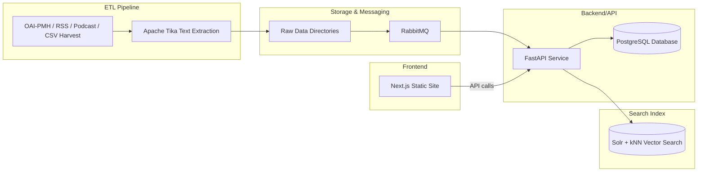

# Digital Library of Integral Ecology
#### High‑level architecture & plug‑and‑play design

---

# Agenda
1. What & Why
2. Core Components & Architecture
3. Plug‑and‑Play Modularity
4. Example Use Cases
5. Next Steps & Q&A

---

# What & Why

- Open‑access, semantic digital library for ecology resources  
- Harvests metadata & full‑text from OAI‑PMH feeds, RSS/podcasts, CSV  
- Stores data in a database and search index for rich discovery  

---

# Core Components & Architecture

---

# Plug‑and‑Play Modularity

- **ETL**: Celery + Python tasks ⟶ any ingestion framework  
- **Text Extraction**: Apache Tika ⟶ any NLP pipeline  
- **API**: FastAPI ⟶ any REST/GraphQL server  
- **Database**: PostgreSQL ⟶ any SQL/NoSQL store  
- **Index**: Solr kNN ⟶ Elasticsearch, Vespa, Pinecone…  
- **Frontend**: Next.js ⟶ Vue, Angular, static SSGs

---

# Example Use Cases

--  Education Portal: curated exhibits & syllabi  
--  Research Dashboard: semantic search across texts, data, & media  
--  Community Library: plug‑in new data sources (CSV, local drives)  
--  Domain Modules: “Story of a Place” storymaps, timelines, annotations

---

# Placeholder: Frontend Screenshot

Screenshot placeholder (search UI)

---

# Next Steps & Q&A

- Add real screenshots & demo videos  
- Align with style guide & branding  
- Define deployment (Docker Compose, k8s, serverless)  
- Questions?